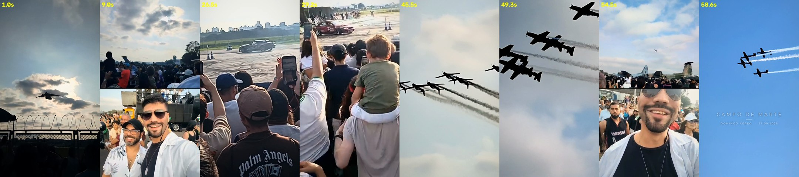

# Campo de Marte · Domingo Aéreo 27.09.2026

Um único vídeo vertical (9:16, 1080×1920, 24 fps, 60 s) feito a partir de todo o material gravado no
**Domingo Aéreo do PAMA-SP, no Campo de Marte**, com a Esquadrilha da Fumaça (A-29 Super Tucano) como
protagonista e Rodolfo e o tio Ferrari como quem estava lá vivendo aquilo.

**Entrega:** [`entrega/CampoDeMarte_Instagram.mp4`](entrega/CampoDeMarte_Instagram.mp4): pronto para Stories/Reels,
1080×1920, **60 fps reconstruídos por IA**, H.264 High, 59,9 s, −14 LUFS, cartela dentro da área segura. Também:
[`entrega/trilha_original.mp3`](entrega/trilha_original.mp3) e [`entrega/quadros_chave.jpg`](entrega/quadros_chave.jpg).

## Etapa 2 · fluidez, drifts e Instagram

- **Tempo real de cada quadro.** 16 dos 33 vídeos do WhatsApp têm cadência irregular. Cada instante de
  saída é posicionado entre os dois quadros reais pelo timestamp verdadeiro de cada um, não pela ordem.
  Assim somem os "soquinhos" de velocidade, e quadros duplicados (4 nos trechos usados) são descartados.
- **Interpolação por IA (RIFE 4.26)** até 120 fps no master. O fluxo óptico da IA é calculado na imagem
  original e usado para transportar as versões ampliadas por IA (Real-ESRGAN) dos quadros reais. Assim o
  detalhe fica estável no tempo em vez de "ferver" quadro a quadro.
- **Antifantasma.** Onde as duas imagens transportadas discordam (oclusão, fumaça), usa-se o quadro real
  mais próximo em vez de sobrepor os dois. Isso evita avião ou carro duplicado.
- **Obturador curto físico** (~1/240 s) aplicado ao longo do movimento de cada pixel, para os quadros
  novos terem o mesmo borrão natural de uma câmera.
- **Estabilização** que separa o tremor involuntário (>~2 Hz, removido em 60–85%) do movimento intencional
  (panorâmica e acompanhamento, preservados). A câmera continua com cara de celular, só que firme.
- **Drifts** entram entre a abertura aérea e a virada vertical (25,5–30 s) como mudança de energia: o
  carro de lado na fumaça com os celulares erguidos, depois a criança nos ombros vendo o carro vermelho
  deslizar. A trilha vira um groove mais urbano nesse trecho e volta para o céu na subida vertical.
- **Áudio com IA (Demucs).** Separação voz/resto em todos os trechos. Motores e pneus ganham presença nas
  ações, as falas do locutor ficam mais limpas, e o "olha, olha, olha" do público no ápice fica inteiro.
- **Medição antes × depois** (salto por quadro, P95): KC-390 32→13 px; tonneau 52→24 px; formação no ápice
  78→23 px; diamante 80→16 px. Nenhum quadro repetido.



---

## 1. O material (5 ZIPs, 33 vídeos, 7 fotos)

Todos os arquivos foram assistidos quadro a quadro (folhas de contato a 1 e 4 quadros/s), medidos
(nitidez, exposição, trajetória das aeronaves, envelope de áudio) e transcritos (Whisper, com marcas de
tempo por palavra). A transcrição revelou que quase todo vídeo traz ao fundo o **locutor oficial da
Fumaça**, o que permitiu identificar cada manobra pelo nome e usar as falas dele como fio narrativo.

| Arquivo | O que mostra | Uso |
|---|---|---|
| WA0035 (vertical) | KC-390 Millennium em passagem baixa, silhueta contra o sol, depois exatamente sobre a câmera | **Abertura** |
| WA0052 | Multidão, caminhão de som, aeronaves estáticas; locutor: *"…com seus sete aviões em formatura duplo-diamante, inicia a demonstração número 4194 aqui na cidade de São Paulo"* | Contexto + locução |
| WA0034 (câmera dupla) | Rodolfo e o tio Ferrari juntos; Rodolfo gargalhando enquanto um A-29 passa | Rodolfo + Ferrari |
| WA0032 (câmera dupla) | Formação passando + Rodolfo com crianças acenando atrás; Ferrari fazendo "V" | Rodolfo + Ferrari |
| WA0033 | Duplo-diamante chegando, rastreado de perto | Abertura do show |
| WA0082 | Solo: *"tonneau de quatro tempos… 1, 2, 3"* | Primeira manobra |
| WA0060 | Par: *"manobra extremamente clássica, muito bonita"* | Par em mergulho |
| WA0040 | Solo passa e sobe na vertical | Virada vertical |
| WA0064 | Cruzamento com o A-29 colorido, o outro sobe na vertical | Cruzamento |
| WA0070 | Formação subindo até encher o quadro (*"giro completo com os alas em voo invertido"*); formação indo embora | Escalada + final |
| WA0102 | Seis A-29 em formação cerrada | Escalada |
| WA0044 | *"Wing com troca"*: A-29 colorido girando sobre o outro | Pré-ápice |
| WA0046 | **Voo de dorso em formação** (recorde mundial) passando enorme; alguém grita *"olha, olha, olha"* | **Ápice** |
| WA0098 | Diamante; locutor: *"vamos ouvir os motores…"* e *"Uma salva de palmas…"* | Ápice + locução |
| WA0054 | Criança nos ombros ergue os braços | Reação |
| WA0036/37/38/39/41/42/45/48/56/66/78/86/90/94 | Solos, loops, vrille, formações distantes, multidão | Avaliados; versões inferiores do mesmo tipo de momento |
| WA0109/0110/0111, VID_164536 | Show de drift (carros) | Fora: não é aviação |
| Fotos (15:40 e 16:34) | Multidão na exposição; Rodolfo e Ferrari diante do C-130 "76" | Referência de identidade e horário |

**Duplicatas.** WA0110 é a versão WhatsApp (848×478) de VID_20260927_164536 (1080p): mesmo take, mesma
duração. A correlação cruzada de áudio entre todos os pares (528 comparações) não encontrou outros
vídeos gravados simultaneamente por celulares diferentes. Os "quase iguais" são momentos parecidos
(várias passagens da formação, vários loops), e para cada tipo ficou só a versão mais forte, com a
aeronave maior no quadro, melhor rastreada e com céu mais limpo. WA0048 e WA0056, por exemplo, perderam
para WA0046, WA0102 e WA0070.

**Quem é quem.** Rodolfo: camisa branca aberta sobre camiseta preta, óculos aviador, plaqueta no
pescoço (câmera de selfie e foto de 16:35). Tio Ferrari: boné preto, óculos de grau, barba grisalha,
camisa branca estampada de folhas (foto de 16:34 e câmera dupla).

## 2. Narrativa (60 s, grade musical de 120 BPM)

| Tempo | Plano | Momento |
|---|---|---|
| 0,0 | KC-390 surge contra o sol e passa por cima | gancho: escala, som crescendo, impacto no tempo 4,0 |
| 4,5 | Multidão, caminhão, aviões estáticos | locutor abre o show |
| 8,0 | Rodolfo + Ferrari (câmera dupla) | "nós estávamos lá" |
| 10,5 | Rodolfo, crianças acenando, a formação passa em cima | expectativa → revelação |
| 14,0 | Duplo-diamante enche o quadro | abertura musical |
| 18,0 | Tonneau de quatro tempos | a harpa responde à contagem do locutor |
| 22,0 | Par em mergulho | |
| 26,0 | Solo sobe na vertical | arpejo ascendente acompanha a subida |
| 29,5 | Cruzamento; o A-29 sobe | |
| 33,0 | Formação sobe e cresce no quadro | clímax começa |
| 38,0 | Seis A-29 cerrados | |
| 41,0 | Wing com troca | *"vamos ouvir os motores…"* |
| 43,0 | **Voo de dorso em formação** | a música para; só os motores e o público |
| 48,0 | passagem mais próxima | a música volta inteira |
| 49,5 | Diamante passa e mergulha | |
| 52,25 | Criança ergue os braços | *"Uma salva de palmas…"* |
| 53,5 | Rodolfo gargalha, A-29 atrás | |
| 55,5 | Ferrari e Rodolfo, "V" | |
| 56,75 | Formação se afasta no azul | cartela final |

Continuidade: todos os cortes foram escolhidos pela direção de voo na tela. As aeronaves seguem
**para a direita** em S05–S08, a virada vertical (S08–S10) muda o eixo, e a partir daí elas seguem
**para a esquerda** até o final. Os planos de pessoas usam o layout da própria câmera dupla (em cima o
que eles viam, embaixo eles), que é como o celular gravou.

## 3. Imagem

- **Câmera virtual 9:16** que segue as aeronaves detectadas em cada quadro (silhuetas contra o céu,
  separadas da fumaça por fechamento morfológico e máscara de solo). O caminho é suavizado com
  antecipação, deixa espaço à frente do movimento e mantém a formação inteira no quadro; há keyframes
  manuais onde o rastreamento automático errava.
- **Estabilização** dos planos em solo por correlação de fase, removendo o tremor e mantendo as panorâmicas.
- **Upscaling por IA** (Real-ESRGAN, rede compacta, com mistura de denoise por plano) de ~270×480 para
  1080×1920; em rostos a IA é misturada com Lanczos para preservar a pele.
- **Cor por plano**: balanço de branco pelas nuvens, níveis robustos, dehaze leve onde a fumaça
  lavou o céu, curva S suave, saturação contida. Por cima, a mesma finalização para todos: split-tone
  sutil, vinheta e grão fino.
- **Interpolação por fluxo óptico** (DIS bidirecional) para converter as fontes de 30 fps e 24,17 fps
  para 24 fps sem saltos.
- Nenhum quadro foi inventado: nada de manobra, pessoa ou evento que não esteja nas gravações.

## 4. Som

- **Tom derivado do evento.** O zumbido da hélice do A-29 medido nos clipes fica em ~110 Hz (Lá2), com
  um segundo polo em Ré3, então a trilha original está em **Lá maior** e o motor real vira a nota pedal.
- **Trilha composta para a imagem** (síntese própria: piano de feltro aditivo, cordas, metais,
  taikos, harpa, impactos e reverb de convolução). Estrutura: drone e batimento no KC-390, tema de
  "memória" sob o locutor, abertura na formação, notas de harpa sobre a contagem "1, 2, 3", arpejo na
  subida vertical, silêncio em *"vamos ouvir os motores"* e retorno do refrão na passagem mais próxima.
- **Som direto em primeiro plano.** O som de cada plano entra com J/L-cuts, e uma sala curta comum
  "cola" celulares diferentes na mesma acústica. As falas do locutor foram posicionadas por palavra, e
  a música abaixa sob a voz.
- Master: −14 LUFS integrado, pico real ≤ −1 dBTP, AAC 320 kbps.

## 5. Autocrítica: o que a revisão encontrou e foi corrigido

1. **Céu azul "HDR".** A medição quadro a quadro mostrou saturação dobrada nos planos só de céu. Os
   aviões ocupam tão poucos pixels que o auto-níveis esticava a faixa estreita do céu inteira. Os níveis
   agora só podem ajustar levemente, e a saturação final fica em ±5% da gravação original.
2. **Névoa acinzentada.** Nos céus tomados pela fumaça, a normalização de exposição escurecia a imagem.
   A exposição passou a só clarear, e o dehaze, mais presente apenas nesses planos, recupera o azul e o
   volume das nuvens.
3. **Cruzamento (S09).** O rastreamento automático perdia o A-29 que sobe na vertical e o quadro ficava só
   com a fumaça. Keyframes manuais passaram a acompanhar a subida, que leva direto à formação subindo no
   plano seguinte.
4. **Criança (S15).** Começava antes de ela entrar no quadro e cortava as mãos erguidas. Ajustei entrada,
   duração e altura do enquadramento.
5. **Multidão com cara de IA.** Em recorte 1:1, o Real-ESRGAN puro deixava cabelos e multidão com textura
   de pintura. Nos planos com pessoas agora é 55% Lanczos + 45% IA com denoise baixo.
6. **Mixagem.** Na primeira passada a música ficava ~10 dB abaixo do ruído dos celulares e não aparecia.
   Rebalanceei: música no nível do ambiente na ação, ambiente dominando no "drop" e música liderando no
   refrão.

Ficou como está, por fidelidade ao que foi gravado: em S10 e S13 a formação passa por cima e sai pelo
topo do quadro, porque o cinegrafista não conseguiu acompanhar, e isso reforça a escala. A mudança do
azul limpo para o céu enfumaçado em S12→S13 é real e coincide com o silêncio da música. As fotos não
entraram no corte: são de depois do show (16h34) e virariam uma sequência de slides.

## 6. Reproduzir

```
work/track_all.py   # detecção de aeronaves quadro a quadro
work/render.py      # planos (use --final para Real-ESRGAN)
work/music.py       # trilha original
work/mix.py         # mixagem e master
work/assemble.py    # montagem, cartela, mux
```
Dependências: ffmpeg, Python 3 com numpy, scipy, opencv, torch (CPU), librosa, numba, soundfile,
pyloudnorm, Pillow. Pesos: `realesr-general-x4v3` e `realesr-general-wdn-x4v3` (Real-ESRGAN, BSD-3).
Fontes: Montserrat (OFL).

Contexto pesquisado: programação do Domingo Aéreo 2026 (PAMA-SP, 27/09, Esquadrilha da Fumaça às
10h30 e 15h30, KC-390, exposição estática e drift) e histórico da Fumaça (recorde mundial de 2006 com
aviões em voo de dorso, homologado pelo Guinness).
